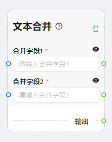

# 文本合并

***

## 图示

<figure><figcaption></figcaption></figure>

## **简介**

`文本合并` 节点用于将两个文本字符串合并成一个字符串。该节点将两个输入字符串进行合并，并输出合并后的结果。

## **参数详解**

* **合并字段1**：待合并的第一个文本字符串。
* **合并字段2**：待合并的第二个文本字符串。

## **输出类型**

合并后的文本字符串。

## **使用方法**

1. **配置节点参数**：
   * 在节点配置界面中，输入待合并的两个文本字符串，分别对应参数 `merger1` 和 `merger2`。
2. **连接节点**：
   * 将 `文本合并` 节点连接到其他节点，以便在工作流中执行合并操作。
3. **执行节点**：
   * 执行工作流程，确保`文本合并` 节点被触发执行。
4. **查看输出**：
   * 执行成功后，可以从`文本合并` 节点的输出端口获取合并后的文本字符串。

## **示例**

假设有两个输入文本字符串分别为 "Hello, " 和 "world!"，我们将它们合并起来，得到的输出结果应为 "Hello, world!"。

***

## **注意**&#x20;

在使用该节点时，请确保输入的文本字符串不包含特殊字符或换行符，以免影响合并结果的准确性。
